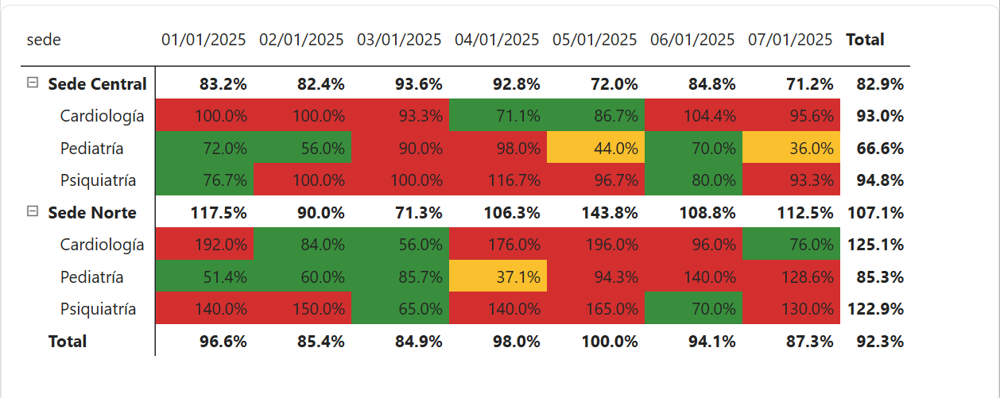
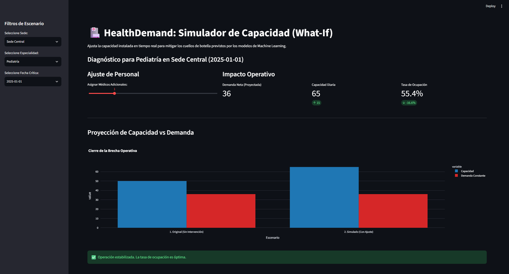

# S08-26-equipo-25-HealthDemand-Sistema-de-Prediccion-y-Gestion-de-Demanda-de-Turnos

# 🏥 HealthDemand: Predictive Capacity Planning & Operations


> **De la gestión reactiva a la anticipación estratégica.**
> HealthDemand es una solución analítica *End-to-End* diseñada para redes hospitalarias. Cruza modelos de Machine Learning y Business Intelligence para predecir la demanda de pacientes, mitigar el impacto del ausentismo (No-Show) y simular la reasignación operativa de recursos médicos en tiempo real.

---

## 🚀 El Problema de Negocio vs. La Solución

La planificación tradicional de turnos suele ser a ciegas. Esto genera agendas médicas saturadas, tiempos de espera insostenibles o, por el contrario, consultorios vacíos (No-Shows) que representan fugas de capital operativo.

**HealthDemand transforma la operación respondiendo tres preguntas críticas:**
1. **¿Cuántos pacientes reales cruzarán la puerta?** (Pronóstico de demanda neta).
2. **¿Quiénes tienen mayor riesgo de no asistir?** (Clasificación probabilística).
3. **¿Qué hacemos hoy para evitar el colapso de los próximos 7 días?** (Simulación "What-If").

---

## 📈 Impacto Operativo y Resultados Clave (Business Value)

Este ecosistema no solo genera predicciones, sino que impacta directamente en el *Bottom Line* (rentabilidad) y el nivel de servicio de la clínica mediante los siguientes resultados:

* 🎯 **Recuperación de Capacidad Ociosa (Overbooking Seguro):** El modelo XGBoost identifica con un **76% de efectividad** a los pacientes con alto riesgo de ausentismo. Esto permite a la clínica sobre-agendar turnos estratégicamente de forma segura, reduciendo las "horas-médico" perdidas por inasistencias.
* 📉 **Reducción del Costo de Reacción:** Al proyectar la demanda bruta con LightGBM y cruzarla con la capacidad instalada a 7 días, se elimina la necesidad de aprobar horas extras de emergencia o contratar médicos de reemplazo de último minuto.
* ⚖️ **Estabilización de la Tasa de Ocupación (KPI):** El simulador prescriptivo facilita decisiones precisas para mantener el nivel de servicio. En lugar de tener días al 120% de saturación (mal servicio) y días al 50% (pérdida de dinero), la redistribución inteligente mantiene la operación en un margen óptimo y rentable (85% - 90%).

---

## 🧠 Arquitectura del Sistema (Pipeline Analítico)

El proyecto abarca el ciclo completo del dato, desde el procesamiento hasta la toma de decisiones gerenciales, dividido en 4 pilares tecnológicos:

### 1️⃣ Data & Feature Engineering (Python/Pandas)
* **Ingesta y Limpieza:** Procesamiento de bases de datos operativas con resolución de anomalías y consistencia de tipos de datos.
* **Feature Engineering:** Construcción de variables complejas como el *Lead Time* (anticipación de reserva), promedios móviles y riesgo histórico ponderado por especialidad médica.

### 2️⃣ Dual Machine Learning Modeling
Para capturar la naturaleza operativa, se implementó una arquitectura de doble modelo:
* **Modelo de Riesgo (XGBoost Classifier):** Predice la probabilidad individual de que un paciente falte a su cita, permitiendo habilitar *overbooking* seguro.
* **Modelo de Demanda (LightGBM Regressor):** Algoritmo de series temporales que pronostica el volumen bruto diario de solicitudes por Sede y Especialidad médica.

### 3️⃣ Control Room Operativo (Power BI)
* **Modelado Dimensional (Star Schema):** Diseño óptimo conectando catálogos de dimensiones (`Dim_Sede`, `Dim_Especialidad`, `Dim_Calendario`) con los resultados predictivos (`Fact_Operativa`).
* **Métricas Dinámicas (DAX):** Cálculo en tiempo real de la *Tasa de Ocupación* mediante división segura de medidas.
* **Semaforización Preventiva:** Implementación de un Mapa de Calor con formato condicional para identificar cuellos de botella exactos en un marco de previsión de 7 días continuos.

### 4️⃣ Entorno de Simulación Prescriptiva (Streamlit)
* **What-If Analysis:** Aplicación web interactiva donde el responsable de planificación visualiza las alertas de colapso y puede inyectar capacidad virtual (ej. sumar +2 médicos) mediante controles deslizantes.
* **Impacto Inmediato:** El sistema recalcula la capacidad diaria y estabiliza la curva de saturación instantáneamente, permitiendo probar escenarios antes de ejecutarlos en el piso de operaciones.

---

## 📊 Vistas del Sistema

### 1. Control Room: Mapa de Calor Operativo (Power BI)

> *Monitoreo macroscópico de la tasa de ocupación. Las alertas rojas indican días específicos donde la demanda neta proyectada superará la capacidad médica instalada.*

### 2. Simulador Prescriptivo de Recursos (Streamlit)

> *Interfaz de ajuste de recursos directivos. Las alertas de saturación se neutralizan dinámicamente al asignar personal de refuerzo, visualizando el cierre de la brecha operativa.*

---

## 📂 Estructura del Repositorio

```bash
HealthDemand/
│
├── 📁 assets/                      # Imágenes de los dashboards para el README
│
├── 📁 data/
│   ├── raw/                        # Historial transaccional bruto
│   └── processed/                  # Datasets con Feature Engineering aplicado (CSV exportado)
│
├── 📁 notebooks/
│   ├── 01_EDA_and_Cleaning.ipynb               # Análisis exploratorio y limpieza
│   ├── 02_Feature_Engineering.ipynb            # Creación de variables
│   ├── 03_XGBoost_NoShow_Predictor.ipynb       # Modelo de clasificación de ausentismo
│   └── 04_LightGBM_Demand_Forecast.ipynb       # Modelo de pronóstico y pipeline de exportación
│
├── 📁 bi_dashboard/
│   └── HealthDemand_Capacity_Planning.pbix     # Modelo de datos y Control Room en Power BI
│
├── 📁 app/
│   ├── app.py                      # Código fuente de la aplicación Streamlit
│   └── requirements.txt            # Dependencias del entorno de simulación
│
└── 📄 README.md                    # Documentación técnica
